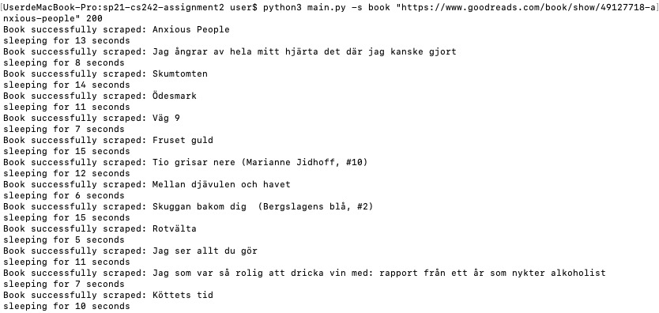
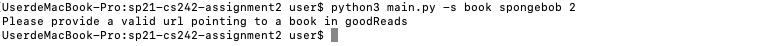
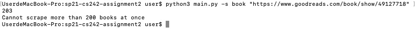
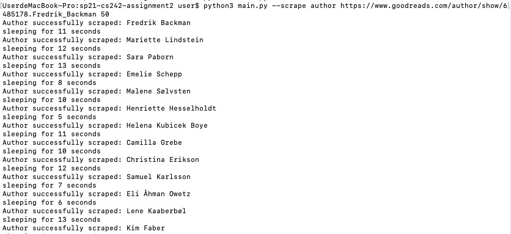
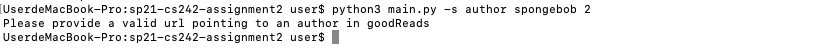
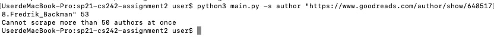

# Manual Test Plan 
Manual test plan for web scraper

## Requirements
Make sure you have the following installed in your device to run scraper.
- [Python3](https://www.python.org/downloads/)
- Pymongo
- Beautiful Soup
- html5lib
- requests

## Instructions

| Steps      | Expected Result |
| ----------- | ----------- |
| Go to goodReads.com, find the url to a book you like | |
| Run ```python3 main.py -s book <your url> <target number> ``` <br> The target number should be less than or equal to 200 | The scraper runs, displaying the names of everybook successfully scraped <br>  |
| Go to the database | Check that the books are successfully updated |
| Run scraper with an invalid url, for example, run ```python3 main.py -s book spongebob 2```| Check that an error occurs and the program exits <br>  |
| Run scraper with a target number greater than 200, for example, run ```python3 main.py -s book "https://www.goodreads.com/book/show/49127718" 203``` |  Check that an error occurs and the program exits <br>  |
| Go to goodReads.com, find the url to an author you like | |
| Run ```python3 main.py -s author <your url> <target number> ``` <br> The target number should be less than or equal to 50 | The scraper runs, displaying the names of every author successfully scraped <br>  |
| Go to the database | Check that the authors are successfully updated |
| Run scraper with an invalid url, for example, run ```python3 main.py -s author spongebob 2```| Check that an error occurs and the program exits <br>  |
| Run scraper with a target number greater than 50, for example, run ```python3 main.py -s author "https://www.goodreads.com/author/show/6485178.Fredrik_Backman" 53``` |  Check that an error occurs and the program exits <br> |
| Run ```python3 main.py -e book book_data.json```| Check that book_data.json is created and data in the database is successfully exported into the book_data.json file|
| Run ```python3 main.py --clear book```| Go to the remote database and check that the book data collection is emptied|
| Run ```python3 main.py -i book book_data.json```| Go to the database and check that the data in the json file is successfully imported into the database |
| Run ```python3 main.py -e author author_data.json```| Check that author_data.json is created and data in the database is successfully exported into the author_data.json file|
| Run ```python3 main.py --clear author```| Go to the remote database and check that the author data collection is emptied|
| Run ```python3 main.py -i author author_data.json```| Go to the database and check that the data in the json file is successfully imported into the database |
